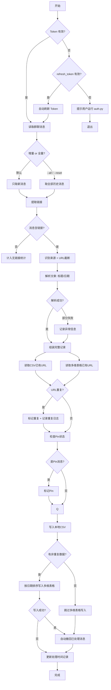

# 飞书群消息整理工具 - 产品需求文档（PRD）

**版本**: v1.1.0
**PRD编号**: PRD-002
**日期**: 2026-02-15
**状态**: 已发布
**基于**: PRD-001 (v1.0.0)

---

## 变更摘要

相对于 PRD-001 (v1.0.0) 的主要变更：
- 入库方式从飞书电子表格改为飞书多维表格（wiki 下的 bitable）
- 新增本地 CSV 事件日志（重复日志 + 解析异常日志）
- 新增知乎问答链接识别
- 消息撤回从手动参数改为处理成功后自动执行
- 移除 `--syncfeishutable`、`--recall`、`--confirm-each` 命令行参数

---

## 目录

1. [版本变更概述](#1-版本变更概述)
2. [核心业务流程](#2-核心业务流程)
3. [新增用户故事](#3-新增用户故事)
4. [变更用户故事](#4-变更用户故事)
5. [非功能需求](#5-非功能需求)
6. [已知限制](#6-已知限制)
7. [附录](#7-附录)

---

## 1. 版本变更概述

### 1.1 新增功能

| 编号 | 功能 | 说明 |
|------|------|------|
| F-01 | 飞书多维表格写入 | 非重复数据按发表日期排序写入 wiki 下的 bitable |
| F-02 | 事件日志 | 重复记录和解析异常记录分别写入 CSV 日志 |
| F-03 | 知乎问答解析 | 识别 `www.zhihu.com/question/` 链接，截断追踪参数 |
| F-04 | 自动撤回消息 | 处理成功后自动撤回群聊中已处理的消息 |

### 1.2 移除功能

| 编号 | 功能 | 说明 |
|------|------|------|
| R-01 | 飞书电子表格同步 | 移除 `--syncfeishutable` 参数及相关代码，由多维表格替代 |
| R-02 | 手动撤回参数 | 移除 `--recall`、`--confirm-each` 参数，撤回改为自动执行 |

---

## 2. 核心业务流程

v1.1.0 的用户旅程更新为：**准备 → 采集 → 入库 → 清理**，其中入库阶段新增多维表格写入，清理阶段改为自动撤回。



---

## 3. 新增用户故事

### US-09 多维表格写入

**作为** 信息收集者，**我希望** 非重复的文章数据自动写入飞书多维表格，**以便** 在结构化的数据库中管理文章索引。

**前置条件**：文章已解析（US-03），重复检测已完成（US-06）。

**业务规则**：
- wiki 下的 bitable 的 app_token 与 wiki_token 相同，直接配置即可
- 从多维表格读取已有 URL 集合，用于去重
- 写入条件：URL 不在多维表格已有记录中（与 CSV 重复状态无关）
- 写入前按 publish_date 排序
- 写入字段：标题、日期、星期、链接、来源（由 config.yaml 中 bitable_columns 配置）

**异常处理**：
- 多维表格配置缺失（app_token 或 table_id 为空）→ 跳过多维表格写入，CSV 照常写入
- 单条记录写入失败 → 记录错误，继续写入下一条

**验收标准**：
| 编号 | 条目 |
|------|------|
| AC-1 | 非多维表格已有的数据按发表日期排序写入多维表格 |
| AC-2 | 多维表格已有的数据不重复写入 |
| AC-3 | CSV 重复但多维表格不存在的数据仍写入多维表格 |
| AC-4 | 多维表格配置缺失时不影响 CSV 写入 |
| AC-5 | 写入字段与 bitable_columns 配置一致 |

---

### US-10 事件日志

**作为** 信息收集者，**我希望** 重复数据和解析异常数据分别记录到日志文件，**以便** 追溯和排查问题。

**业务规则**：
- 重复日志（`data/duplicate_log.csv`）：记录标题、日期、链接、来源、消息序号、记录时间
- 解析异常日志（`data/parse_error_log.csv`）：记录原始链接（截断前）、来源、异常信息、消息序号、记录时间
- 追加写入，不覆盖历史记录
- 文件不存在时自动创建并写入表头

**验收标准**：
| 编号 | 条目 |
|------|------|
| AC-1 | 重复记录写入 duplicate_log.csv |
| AC-2 | 解析异常记录写入 parse_error_log.csv |
| AC-3 | 日志为追加模式，保留历史记录 |
| AC-4 | 首次写入自动创建文件和表头 |

---

### US-11 知乎问答解析

**作为** 信息收集者，**我希望** 自动识别知乎问答链接并解析文章信息，**以便** 覆盖更多内容来源。

**业务规则**：
- URL 特征：`www.zhihu.com/question/`
- 来源标识：`APP-知乎`
- URL 截断：保留 `?` 之前的内容
- 解析方法：尝试提取 og:title、title 标签、JSON-LD 日期

**已知限制**：
- 知乎启用了 zse-ck v4 反爬机制，服务端返回 403
- 当前版本无法提取标题和日期，仅能识别来源和截断 URL

**验收标准**：
| 编号 | 条目 |
|------|------|
| AC-1 | 知乎问答链接被识别为 APP-知乎 |
| AC-2 | URL 正确截断追踪参数 |
| AC-3 | 解析失败时记录异常信息，不中断处理 |

---

## 4. 变更用户故事

### US-04 表格写入（变更）

**变更内容**：
- 本地 CSV 写入保持不变（全量写入，包含重复记录）
- 移除飞书电子表格（spreadsheet）写入
- 新增飞书多维表格（bitable）写入（见 US-09）

### US-08 消息撤回（变更）

**变更内容**：
- 移除 `--recall` 和 `--confirm-each` 命令行参数
- 处理完成后自动撤回已处理的消息（无需手动触发）
- 撤回条件：只要消息被写入总日志（message_log.csv）就撤回
- 独立脚本 `src/archive/recall_messages.py` 保留备用

**验收标准**：
| 编号 | 条目 |
|------|------|
| AC-1 | 消息写入总日志后自动撤回 |
| AC-2 | 撤回顺序为倒序 |
| AC-3 | 单条撤回失败不中断，继续下一条 |

---

## 5. 非功能需求

继承 PRD-001 的非功能需求，新增：

### 5.1 数据安全
- 多维表格写入失败时不撤回群聊消息，确保数据不丢失
- CSV 日志追加写入，保留完整历史记录

### 5.2 权限要求
- 新增 `bitable:app` 和 `bitable:app:readonly` 权限（用于读写多维表格）
- 注：`wiki:wiki:readonly` 权限不是必需的，因为 wiki 下的 bitable 的 app_token 与 wiki_token 相同，可直接配置

### 5.3 授权机制
- user_access_token 有效期 2 小时，通过 refresh_token 自动刷新
- user_refresh_token 有效期 30 天，超期需重新运行 auth.py 授权
- 程序启动时自动检测并刷新过期的 access_token

---

## 6. 已知限制

继承 PRD-001 的已知限制，新增：

7. **知乎反爬机制**：知乎启用 zse-ck v4 反爬验证，服务端对非浏览器请求返回 403。已尝试多种方案（不同 UA、session、API、archive.org、搜索引擎缓存等）均无法绕过。当前仅能识别来源和截断 URL，无法提取标题和日期。
8. **观猹 JS 渲染**：watcha.cn 页面为纯 JavaScript 渲染，服务端返回的 HTML 不包含产品信息。当前仅能识别来源，无法提取标题和日期。

---

## 7. 附录

### 7.1 支持的网站来源（更新）

在 PRD-001 基础上新增：

| 来源名称 | URL 特征 | URL截断 |
|---------|---------|---------|
| APP-知乎（问答） | www.zhihu.com/question/ | ✓ |
| Web-观猹 | watcha.cn/products/ | ✗ |

### 7.2 多维表格字段定义

| 字段名 | 类型 | 说明 | 配置键 |
|--------|------|------|--------|
| 标题 | 文本 | 文章标题 | bitable_columns.title |
| 日期 | 文本 | YYYYMMDD 格式 | bitable_columns.publish_date |
| 星期 | 文本 | 对应星期 | bitable_columns.weekday |
| 链接 | 文本 | 完整链接 | bitable_columns.url |
| 来源 | 文本 | 来源平台 | bitable_columns.source |

### 7.3 命令行参数（更新）

| 参数 | 说明 | 变更 |
|------|------|------|
| （无参数） | 只处理新消息 | 不变 |
| `--all` | 处理所有历史消息 | 不变 |
| `--reset` | 清零时间记录后处理所有消息 | 不变 |
| `--start N` | 从第 N 条链接开始处理 | 不变 |
| `--end N` | 处理到第 N 条链接 | 不变 |
| `--list-nolink` | 列出无链接的消息 | 不变 |
| `--help` | 显示帮助信息 | 不变 |
| ~~`--syncfeishutable`~~ | ~~同步到飞书电子表格~~ | 已移除 |
| ~~`--recall`~~ | ~~处理后撤回消息~~ | 已移除（改为自动） |
| ~~`--confirm-each`~~ | ~~撤回时逐条确认~~ | 已移除 |

### 7.4 配置文件新增段

```yaml
target_bitable:
  url: "https://xxx.feishu.cn/wiki/xxx?table=xxx"
  wiki_token: "xxx"
  app_token: ""  # 首次运行自动填充
  table_id: "xxx"

bitable_columns:
  title: "标题"
  publish_date: "日期"
  weekday: "星期"
  url: "链接"
  source: "来源"
```

### 7.5 事件日志文件

| 文件 | 用途 | 字段 |
|------|------|------|
| `data/duplicate_log.csv` | 重复记录日志 | 标题、日期、链接、来源、消息序号、记录时间 |
| `data/parse_error_log.csv` | 解析异常日志 | 原始链接（截断前）、来源、异常信息、消息序号、记录时间 |
| `data/bitable_fail_log.csv` | 多维表格入库失败日志 | 标题、日期、链接、来源、失败原因、消息序号、记录时间 |

### 7.6 性能优化

- 延迟导入重型模块（requests ~600ms、BeautifulSoup ~200ms）
- 程序启动后立即显示标题横幅，然后再加载依赖库
- 启动时间从 ~800ms 优化到 ~70ms
